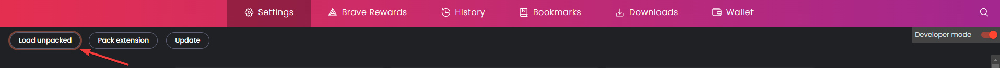

السلام عليكم ورحمة الله وبركاتة 

اضافة للمتصفح للمساعدة في ايجاد او الوصول الي بعض المسارات المهمة او المعلومات المهمة من خلال الصفحة وملفات الجافا سكربت والاداة تعمل بشكل سلبي بمعني انها لا ترسل اي طلبات للموقع جديدة.

## <h2 dir="rtl" align="right"> هدفنا</h2>

هدفنا هو محاولة تعريب المحتوي الاجنبي 

حسابي علي موقع اكس او تويتر:
https://twitter.com/0xElkomy

## <h2 dir="rtl" align="right"> التثبيت google chrome</h2>

هتنزل الفولد وتنخسه تحطه في 
Extenions Page
عندك زي كدا

تنسخه وتحطه في البيدج دي 

- brave://extensions/
- chrome://extensions/

او تعمل 
load unpacked زي الصورة الي فوق

## <h2 dir="rtl" align="right"> نسخة فايرفوكس</h2>

https://addons.mozilla.org/en-US/firefox/addon/findsomething-%D8%A7%D9%8A%D8%AC%D8%A7%D8%AF-%D8%B4%D8%A6-%D9%85%D8%A7/

## <h2 dir="rtl" align="right"> شكرا</h2>
@momosecurity
